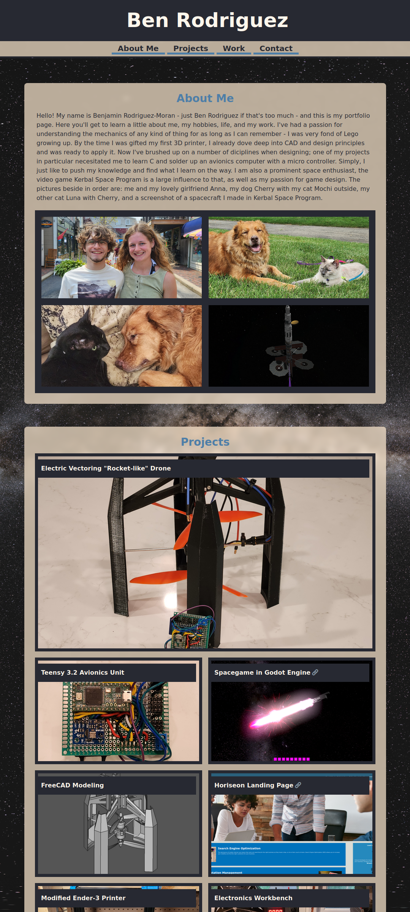

# bens-porfolio-page

## Description
This is my humble portfolio, it uses flexbox dynamic styling and proper semantics. 
## Usage
If you want an example to learn from, clone this repo, I will be updating it as I progress in my learning.
## Credits
MSU Full-stack Bootcamp Coursework, MDN Reference, css-tricks.com
## License
Please refer to the license in the repo